# Detailed Steps for AWS Disaster Recovery Setup

## Tasks to be performed:
1. Provision of an EC2 server in the primary region
2. Provision of an S3 bucket in the primary region
3. Configure S3 cross-region replication
4. Take AMI from the primary region and copy to the DR region
5. Provision an EC2 server using the copied AMI
6. Verify the application working in the DR region
7. Verify the S3 files replicated to the DR region

### Step 1: Provision a new EC2 server and create a custom AMI
• Navigate to EC2 console -> Launch Instance
• Choose Amazon Linux 2 AMI
• Choose t2.micro instance type.
 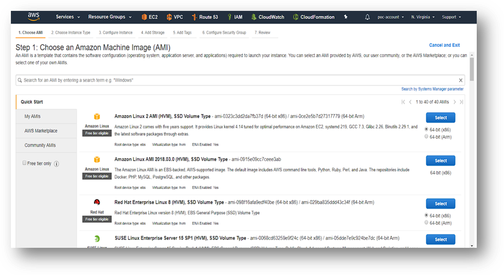
 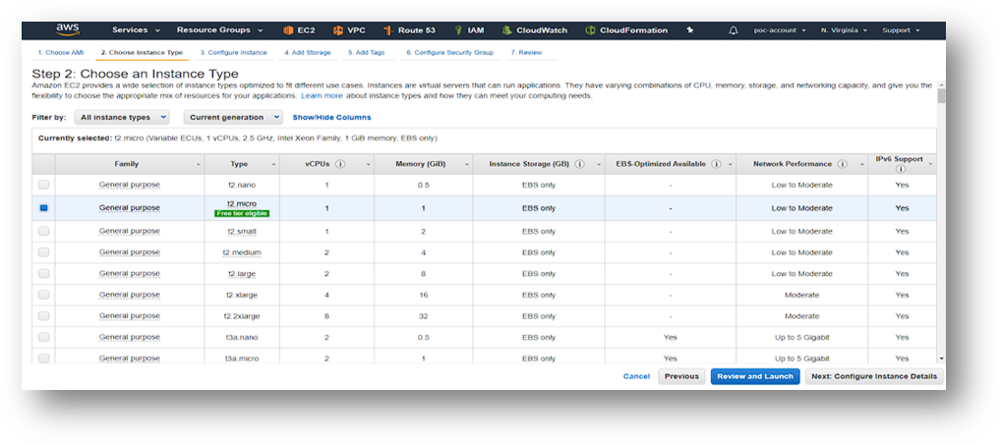
 
### Step 2: Accept default settings and click on Next.
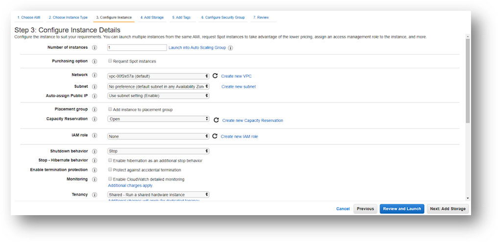

### Step 3: Click on Next.

### Step 4: Click on Next.
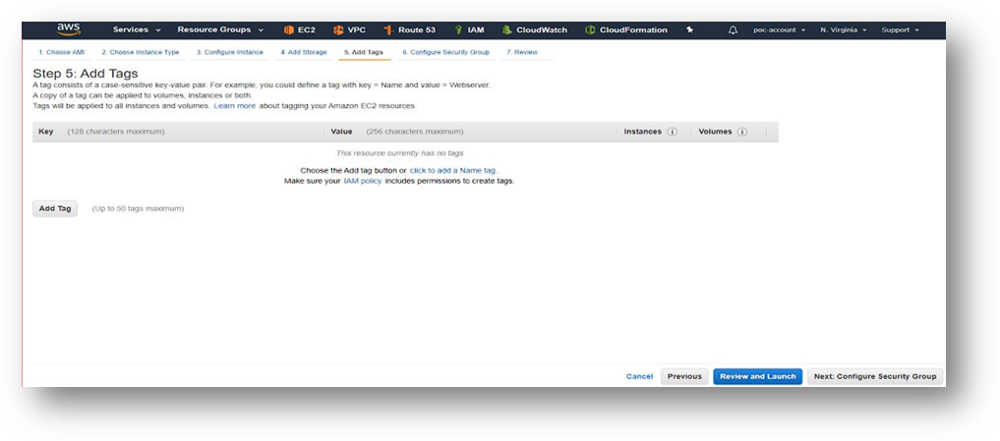
### Step 5: Under Security Groups, add a rule for HTTP traffic (port 80) in addition to the SSH traffic.
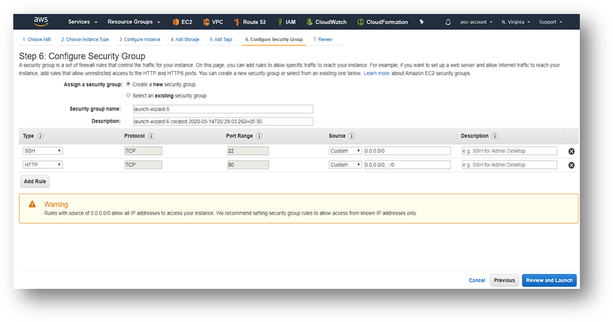
### Step 6: Review and Launch.
### Step 7: Either create a new key pair or choose an existing keypair you possess.
### Step 8: Click on Launch Instance.
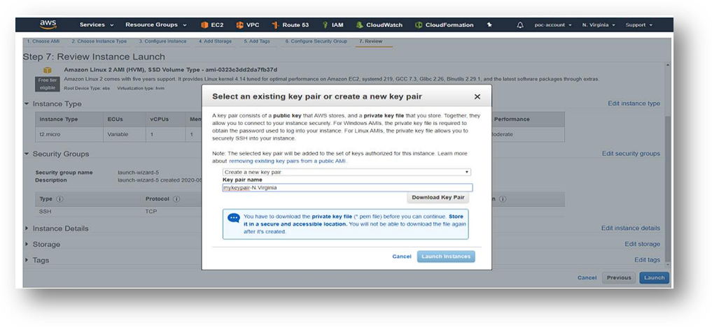
### Step 9: Change the name of the instance to ami-master-instance (for understanding the purpose).
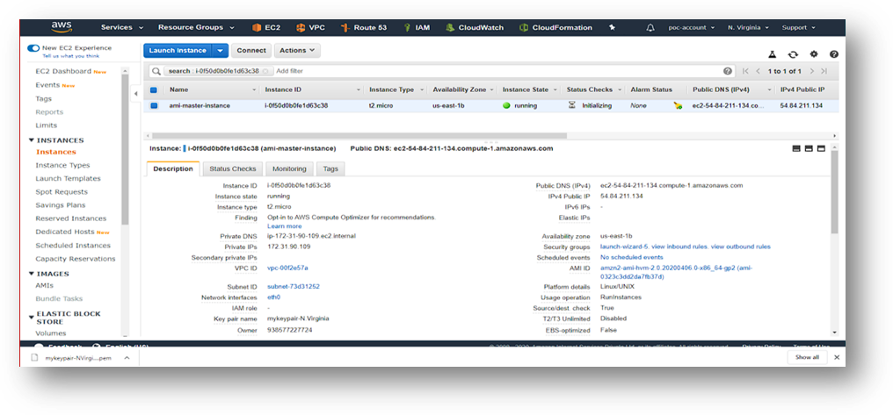
### Step 10: Connect to the ami-master-instance using MoboXTerm or Putty using the key you created earlier.
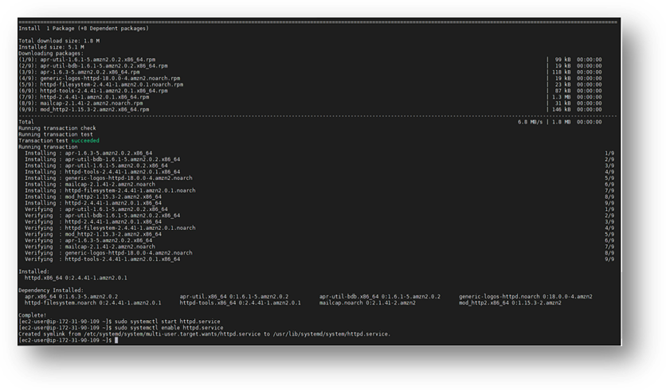

### Step 11: Run the following commands. This will install and configure Apache Web Server with a custom test message.
sudo su -
yum update -y
yum install -y httpd.x86_64
systemctl start httpd.service
systemctl enable httpd.service
echo "Congratulations! You have just installed Apache Web Server. If you can see this 
message, you have configured it correctly. " > /var/www/html/index.html

### Step 12: Verify if you can access the URL of the public IP in a browser and see the custom welcome message.
### Step 13: You have installed and wholly configured your EC2 master instance. 
Now, you can proceed with creating an AMI from this configured EC2 instance.
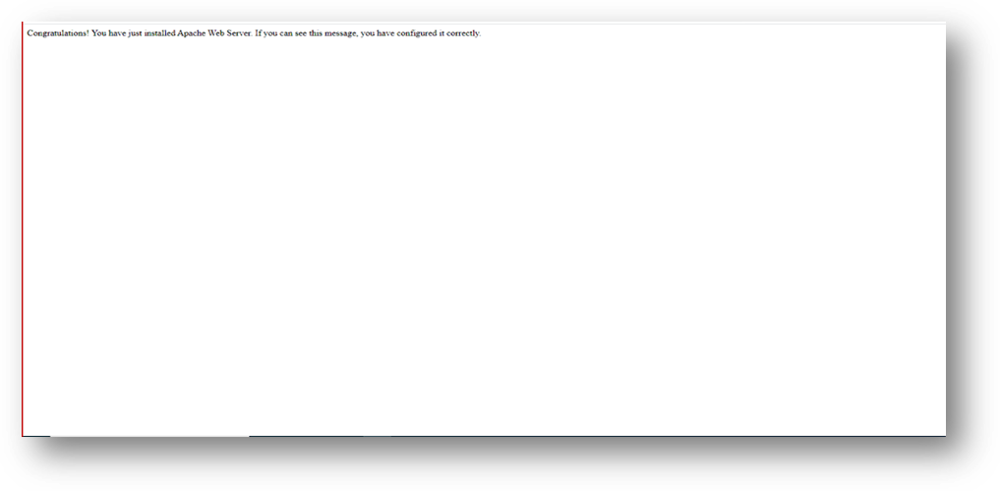

### Step 14: Create AMI from the configured EC2 instance.
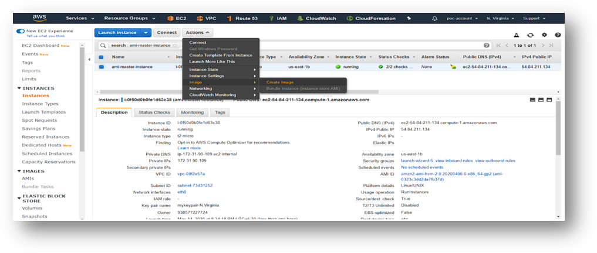

### Step 15: Provide a name for the AMI and click on Create Image.
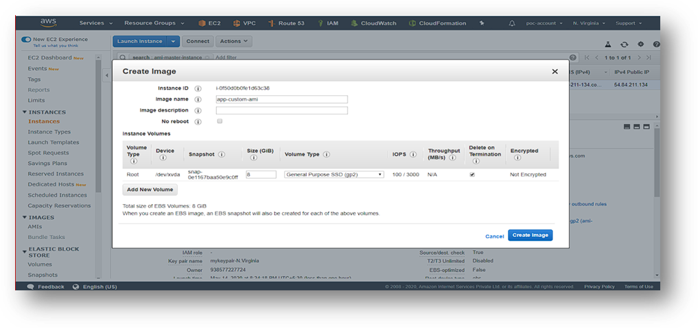

### Step 16: Now, the AMI is successfully created.
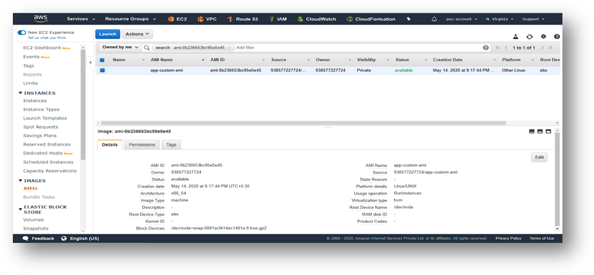

### Step 17: Launch a new EC2 instance using the AMI created in the primary region (us-east-1).
### Step 18: Navigate to EC2 console -> AMIs -> Launch.
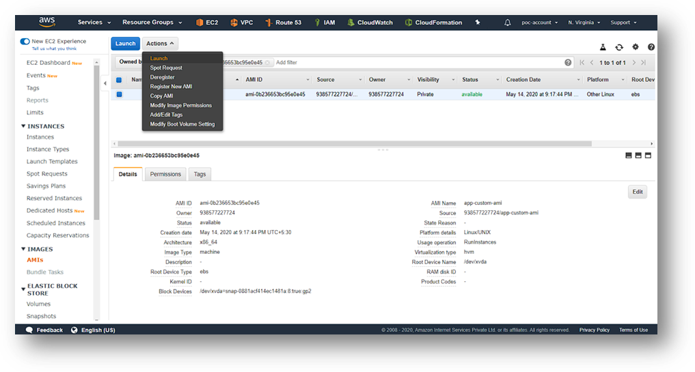

### Step 19: Fill in the below script in the user data section.
echo "Welcome! You have reached the server : $(hostname -f)." > /var/www/html/index.html
echo "The server is launched using $(ec2-metadata -a)" >> /var/www/html/index.html
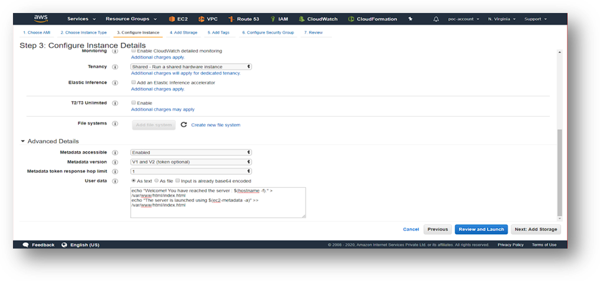

### Step 20: Follow the rest of the configurations as done before and complete the creation of the instance.
### Step 21: Provide a name to the new instance for easy identification, such as app-primary-instance.
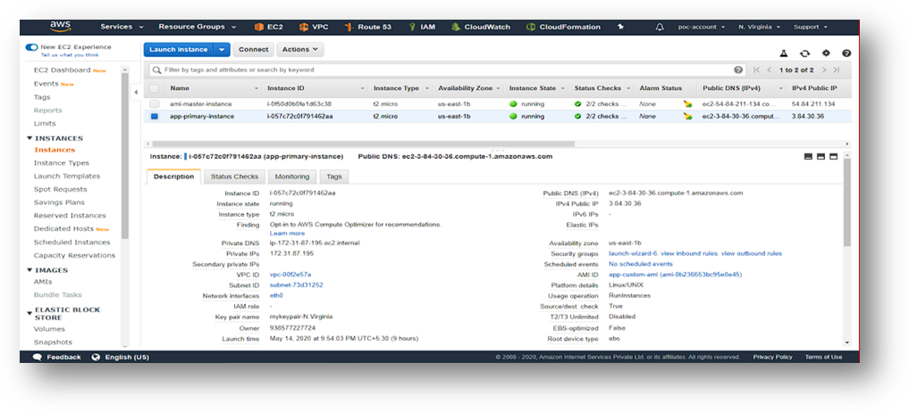

### Step 22: Connect to the instance and run the following commands
sudo su -
echo "Welcome! You have reached the server: $(hostname -f). The server is launched using 
$(ec2-metadata -a)" > /var/www/html/index.htm

### Step 23: Connect to the Public IP address of the instance. You should be able to see the Welcome message, as shown below.
### Step 24: Note down the AMI using which the instance is created in the Welcome message.
### Step 25: Verify if this AMI ID is the same as the AMI you created earlier and launched this instance with.Now, you have configured your application in the primary region.
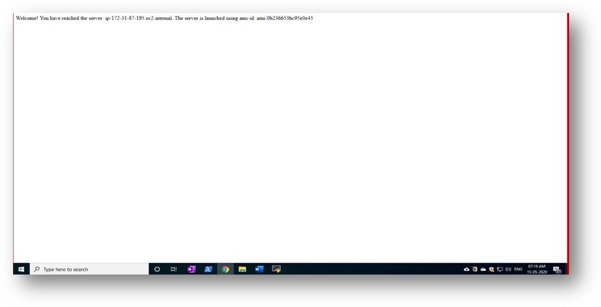
### Step 26: You will then proceed with copying this AMI to the DR region (N. California) and launch an instance there.
### Step 27: Copy the AMI to the DR region (us-west-1)
### Step 28: Navigate to EC2 console -> AMIs -> Actions -> Copy AMI
### Step 29: Destination region -> California (If you are not able to access US West 1, use US East 2 (Ohio))
### Step 30: Click on Copy AMI
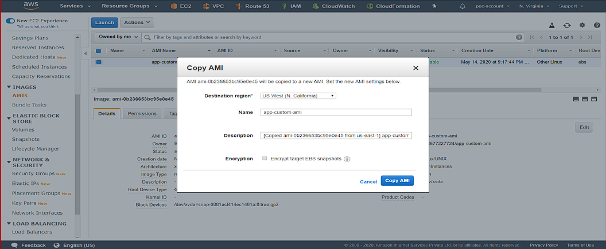
• AMI Copy operation will be initiated, as shown below.
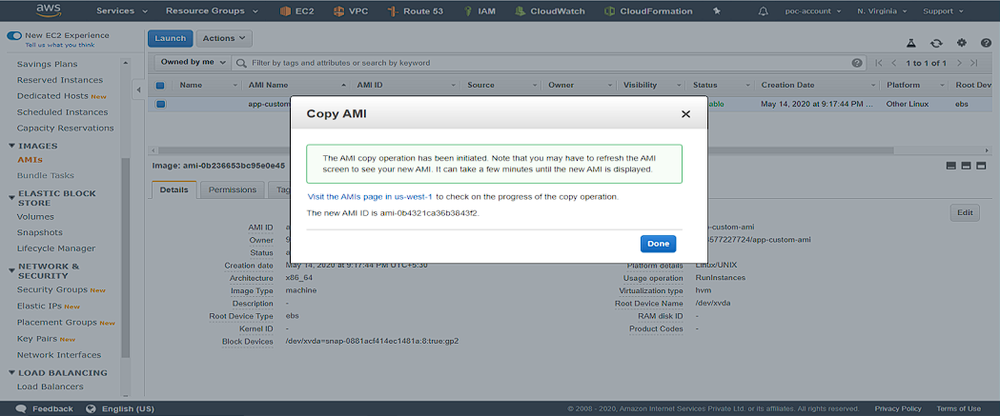
### Step 31: Change the region to us-west-1 to see the progress of the AMI Copy operation.
### After the AMI copy operation is over, you can see a new AMI-ID is created using the copied AMI.
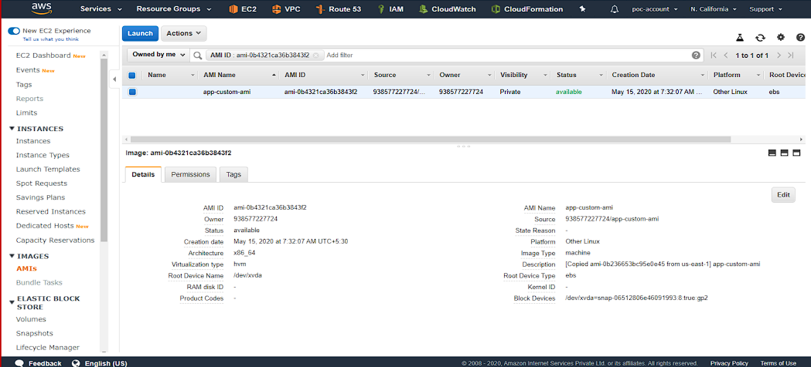

### Step 32: Launch an Instance in the us-west-1 region using the copied image.
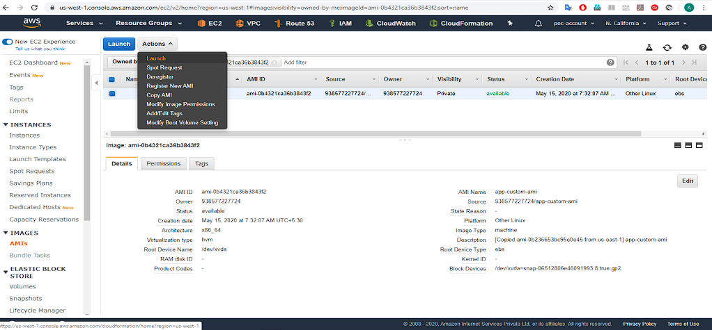

### Step 33: Follow the same steps to create an EC2 instance that you did in the useast-1 region.
### Step 34: Provide a name to the new instance for easy identification, such as app-dr-instance.

### Step 35: Access the public server using a browser and ensure that you are able to see the default message as below.This confirms the DR region instance is using the same image as the primary region.
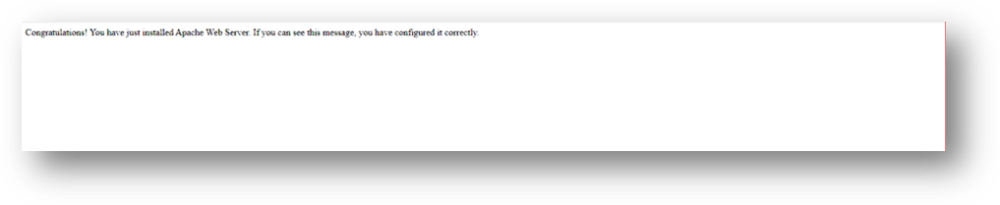

### Step 36: Connect to the instance using SSH PuTTY.
### Step 37: Run the same commands as you did in the primary region.
sudo su -
echo "Welcome! You have reached the server: $(hostname -f). The server is launched using $(ec2-
metadata -a)" > /var/www/html/index.html

As you can see below, the server shows the AMI ID, and this is the same AMI 
you created in the DR region by copying the AMI from the primary region.
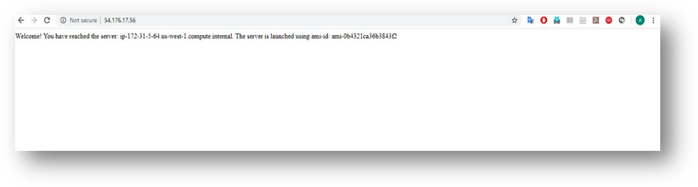
By now, you have successfully copied the AMI from the Primary region to the 
DR region and configured it correctly.
### Step 38: Next, you will move on to configuring S3 cross-region replication.
### Step 39: Create an S3 bucket in the Primary and DR regions and configure cross-region replication
• Navigate to S3 -> Create a bucket
• Bucket Name -> a unique name
• Region -> us-east-1
• Click on Create bucket

### Step 40: Similarly, create another bucket in the DR region (us-west-1). (If you are not able to access US West 1, use US East 2 (Ohio))
### Step 41: After creating the bucket, you should see both buckets as below.
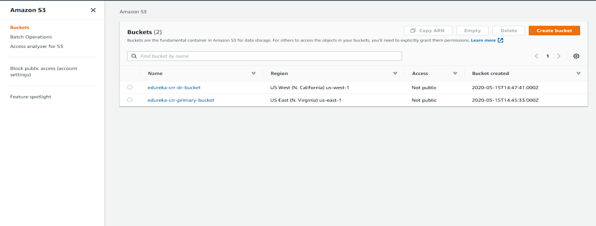

### Step 42: To enable S3 cross-region replication, S3 requires an IAM role with proper access policies. In the article given below, please refer to the access policy
https://docs.aws.amazon.com/AmazonS3/latest/dev/setting-repl-config-permoverview.html
### Step 43: Create an IAM role with a policy for S3 cross-region replication
### Step 44: Click on Create Policy
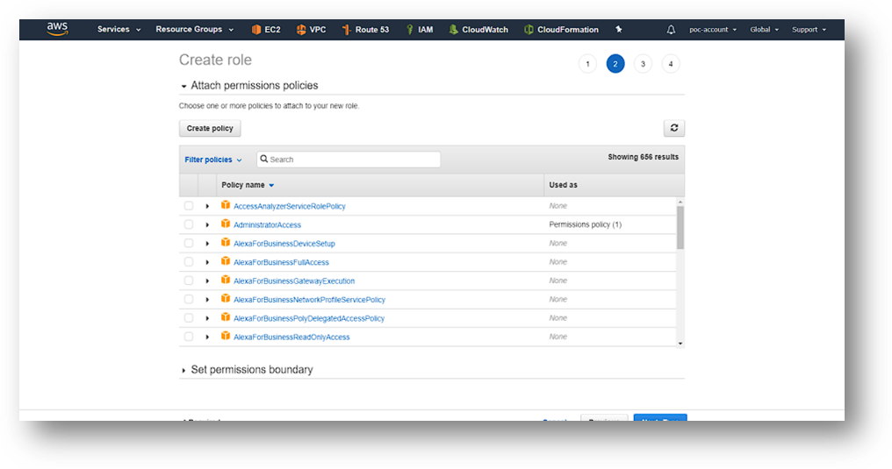
### Step 45: Copy and Paste the policy statement as provided in the reference article above.
### Step 46: Be sure to change the source and bucket destination buckets. The policy statement used for this demo is given below.
{
 "Version":"2012-10-17",
 "Statement":[
 {
 "Effect":"Allow",
20
 "Action":[
 "s3:GetReplicationConfiguration",
 
 "s3:ListBucket"
 ],
 "Resource":[
 "arn:aws:s3:::SourceBucket"
 ]
 },
 {
 "Effect":"Allow",
 "Action":[
 "s3:GetObjectVersion",
 "s3:GetObjectVersionAcl",
 "s3:GetObjectVersionTagging"
 ],
 "Resource":[
 "arn:aws:s3:::SourceBucket/*"
 ]
 },
 {
 "Effect":"Allow",
 "Action":[
 "s3:ReplicateObject",
 "s3:ReplicateDelete",
 "s3:ReplicateTags"
 ],
 "Resource":"arn:aws:s3:::DestinationBucket/*"
 }
 ]
}

### Step 47: Click on Review policy
### Step 48: Provide a name to the policy, as shown below
### Step 49: Click on Create Policy

### Step 50: Now, the policy has been created. You can proceed with creating an IAM role and attach this policy.
### Step 51: Navigate to IAM console -> Create Role
### Step 52: Choose a use case -> S3
### Step 53: Click on Next
### Step 54: Search for the policy you created earlier
### Step 55: Click on Next until the last page
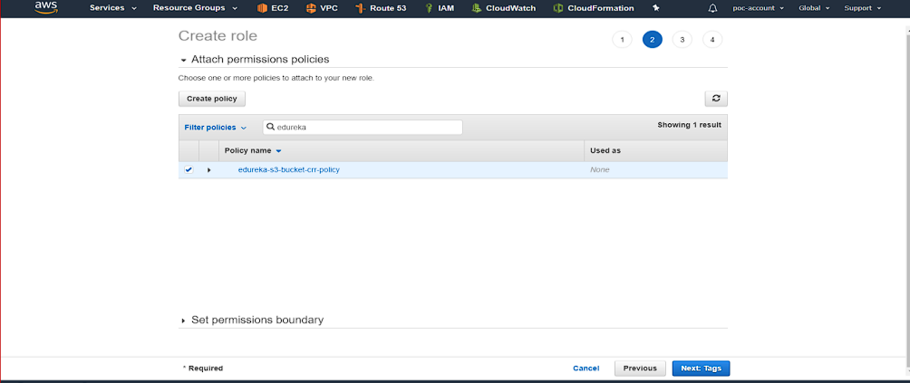
### Step 56: Provide a name to the IAM role
### Step 57: Click on Create role

### Step 58: Now, the IAM role is created. You can proceed with configuring crossregion replication in the S3 bucket in the primary region.
### Step 59: Setup cross-region replication in the primary region
### Step 60: Navigate to S3 -> choose the bucket in the primary region
### Step 61: Go to properties and enable versioning, as it is a prerequisite.
### Step 62: Click on Save
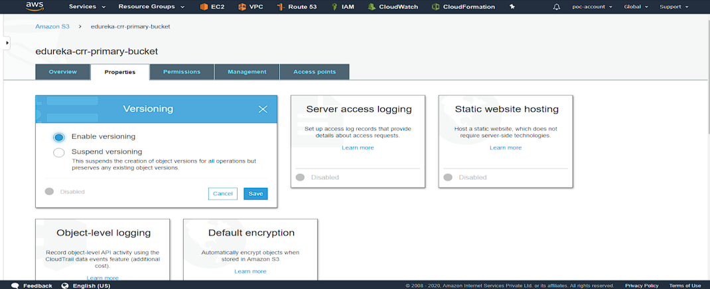
### Step 63: Go to Management -> Replication -> Add rule
### Step 64: Ensure the source is the Entire bucket
### Step 65: Under Replication Criteria, check Replicate objects encrypted with AWS KMS
### Step 66: Choose aws/s3 kms key for encryption
### Step 67: Click on Next
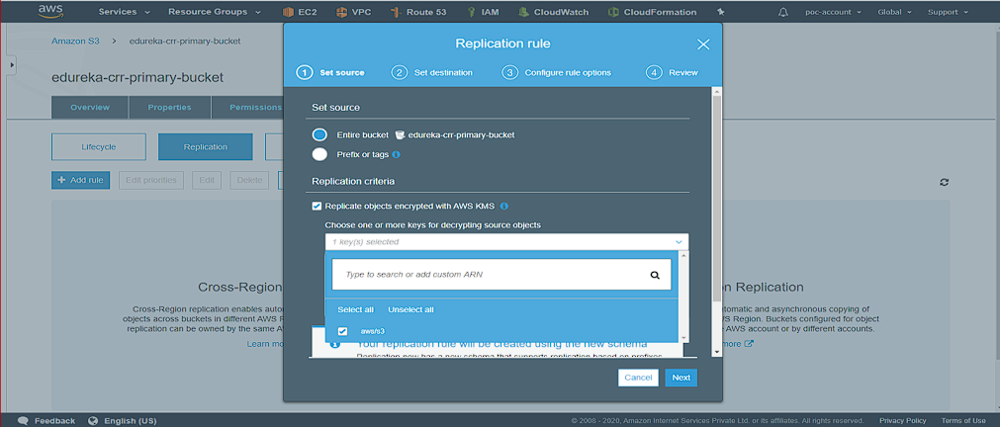
### Step 68: Choose the Destination bucket
### Step 69: Enable Versioning if not enabled earlier
### Step 70: Choose the KMS key AWS aws/s3

### Step 71: Click on Next

### Step 72: Choose the IAM role that you created earlier
### Step 73: Provide a name to the role
### Step 74: Click on Next
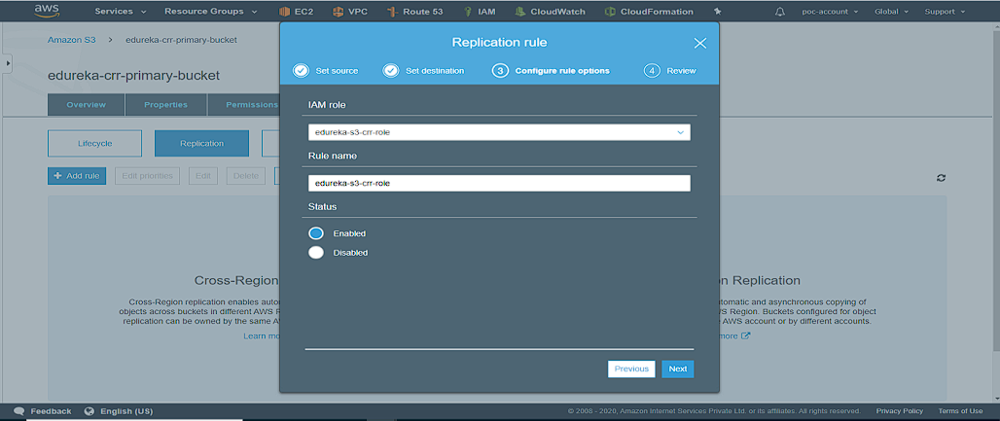
### Step 75: Review and Save

You have successfully configured the S3 cross-region replication. You can see 
the rule details, as shown below
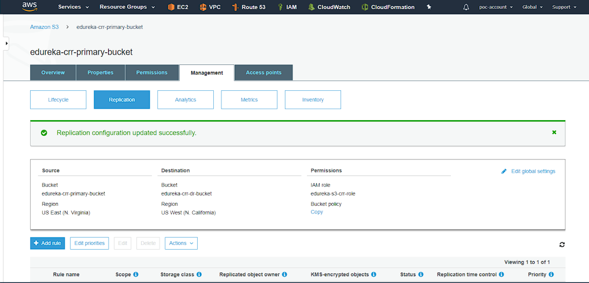
You can now proceed with testing the cross-region replication by uploading a 
test file in the primary region and seeing if it gets replicated in the DR region.
### Step 76: Testing S3 cross-region replication
### Step 77: Upload a file in the primary region s3 bucket
### Step 78: Navigate to S3 -> Upload -> Add files
### Step 79: Choose a test file and click on Next
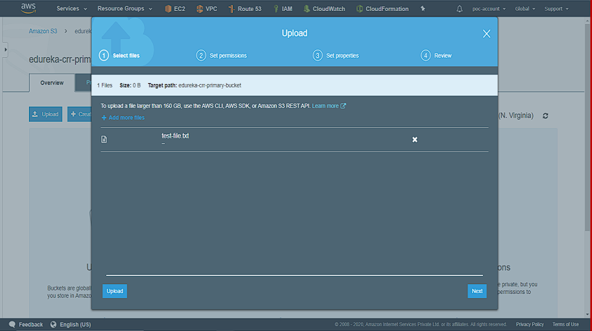
### Step 80: Click on Next
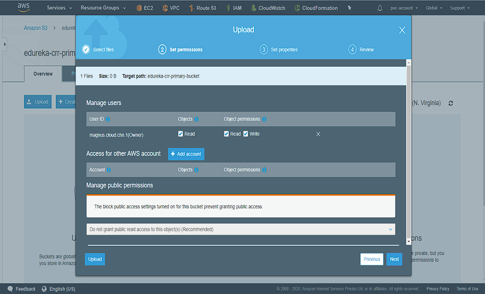
### Step 81: Click on Next
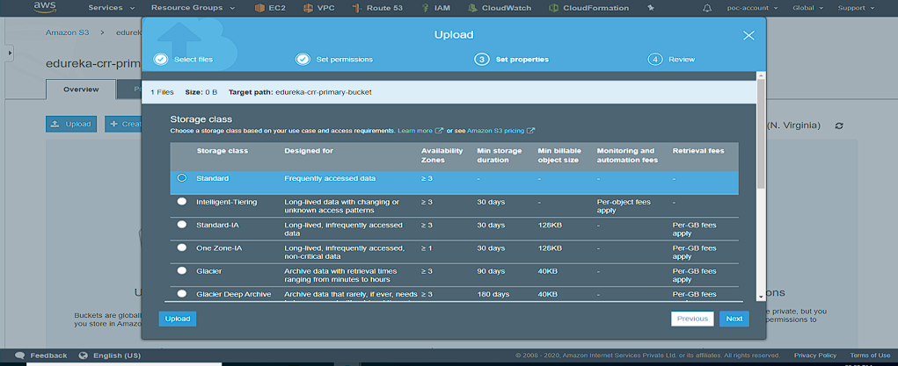
### Step 82: Click on Upload

• You can see the test file uploaded in the primary region, as shown below.
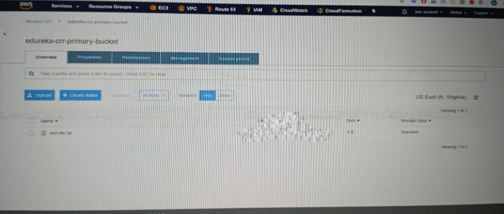
### Step 83: Now, go to the DR region S3 bucket and verify the test-file replicated over there, as shown below.
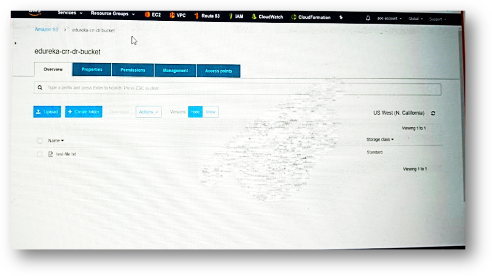
### Conclusion
We have successfully verified the S3 cross-region replication.
